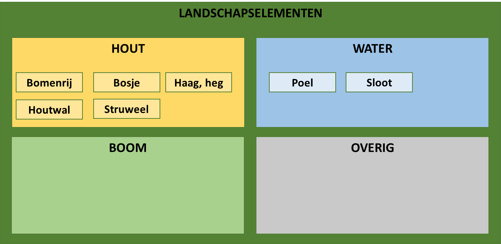

Ontwerpprincipes
----------------

Landschapselementen
-------------------

Het IMLE onderscheid de volgende typen landschapselementen.

*Overzicht landschapselementen*

Dekking
-------

Het IMLE wordt beheerd voor het grondgebied van de referentiepercelen met een
omliggende strook (buffer) van 5 meter.

Niet tot de inhoud van het IMLE behoren de (niet-agrarische) landschapselementen
die buiten dit grongebied valt.

Modellering
-----------

Het IMLE hanteert het Basismodel Geo-informatie (NEN 3610:2011) voor de
modellering. NEN 3610:2011 conformeert zich aan de ISO 19100 standaarden voor
geo-informatie. Deze gelden daarom ook voor de IMLE.

Het IMLE hanteert het Metamodel voor Informatiemodellering (versie 1.1) voor de
vastlegging van de meta-informatie in het IMLE.
