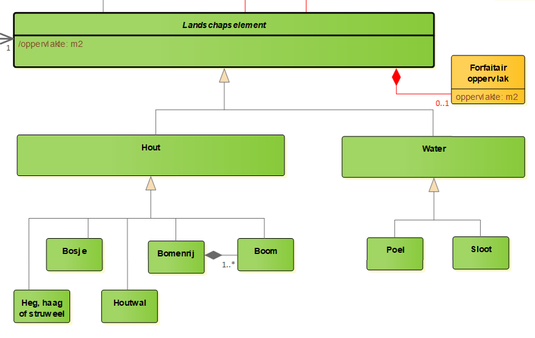

Beschrijving van landschapselementen
====================================

Een landschapselement is een onderdeel van het landschap dat als een vrij
homogeen deel van het totale beeld wordt ervaren. Landschapselementen zijn de
bouwstenen die samen de structuur van het landschap bepalen. Verschillen in
aard, hoeveelheid en samenhang van landschapselementen dragen bij aan de
karakteristieke kenmerken van het landschap. Ze hebben veelal een historische
achtergrond: de invloed van de mens in het verleden op het landschap is er dan
in terug te vinden.

Veel landschapselementen hebben naast een historische en een landschappelijke
ook een landschapsecologische functie: ze kunnen dan beschouwd worden als
ecotopen in een ecosysteem. Ook reliëfvormen met een voornamelijk natuurlijke
ontstaanswijze, aangeduid met het geomorfologische begrip landvorm, worden
landschapselementen genoemd.

Er is tevens een kader document beschikbaar welke de definities beschrijven
waaronder de opdracht wordt uitgevoerd.

Het (keten)werkproces waarin gegevens over landschapselementen worden geproduceerd
==================================================================================

Landschapselementen worden op meerdere plekken bijgehouden en ontsloten. Hier
onder volgt een opsomming van de (keten)werkprocessen waarin landschapselementen
worden geproduceerd

-   BGT bronhouders houden gegevens bij, ook op aanlevering vanuit RVO,
    gebaseerd op Remote Sensing interpretaties van NEO.

-   IMBGT is de belangrijkste basis, als referentiemodel waarvan het RVO model
    tbv ondersteuning van de regelingen wordt afgeleid.

-   RVO Geo gegevensbeheer, beheert de referentie ten behoeve van de uitvoering
    van regelingen.

Stakeholders
============

**Aanbodkant**

Toepassing betreft subsidieverlening door RVO en ANLB.

Lijst met stakeholders die betrokken worden bij de informatiemodellering (zowel
binnen als buiten RVO):
-   RVO: KAI, UB, KPEU, IMP, Afd. Data, JZ, IUC

Stakeholders aan de inwinningskant van data:
-   BGT bronhouders
-   Leverancier bomenregister?

**Vraagkant** 

T.a.v. onderstaande externen nog te bepalen in welke mate deze van toepassing zijn. Voor externe stakeholders worden 3 groepen onderscheiden: De partijen die met de data aan de slag gaan (data afnemers), de partijen die zich bezighouden met grondgebonden regelingen (juristen grondgebonden regelingen) en de partijen die zich bezig houden met EU-regelingen (juristen EU-regelingen).

Data afnemers:
-   B&N (ikv Agrarisch Natuur- en Landschapsbeheer)
-   Softwareleveranciers?
-   BoerenNatuur
-   Agrarische Collectieven
-   Land- en Tuinbouworganisatie Nederland (LTO)

Juristen grondgebonden regelingen:
-   Provincies
-   Ministerie van Landbouw, Natuur en Voedselkwaliteit (LNV)
-   Nederlandse Voedsel- en Warenautoriteit (NVWA)
-   Dienst ICT Uitvoering (DICTU)

Juristen EU-regelingen
-   Het Joint Research Centre (JRC) van de Europese Commissie.

Bestaande softwaresystemen
==========================

In de volgende softwaresystemen worden in de bestaande situatie gegevens over
landschapselementen ingewonnen, bijgehouden, geregistreerd, of beschikbaar
gesteld.

Bestaande registraties
======================

Hieronder volgt een overzicht van de bestaande (basis)registraties waarin
gegevens over landschapselementen zijn geregistreerd:

Basisregistratie Grootschalige Topografie (BGT)
-----------------------------------------------

De [Basisregistratie Grootschalige Topografie
(BGT)](https://www.geobasisregistraties.nl/basisregistraties/grootschalige-topografie)

Basisregistatie Topografie (BRT)
--------------------------------

De [Basisregistatie Topografie
(BRT)](https://www.geobasisregistraties.nl/basisregistraties/topografie)

EU Integrated Administration and Control System (IACS)
------------------------------------------------------

In het Nederlands: Geïntegreerd beheers- en controlesysteem (GBCS).

Het GBCS zorgt ervoor dat betalingen op basis van areaal- en diergebonden
steunregelingen correct worden uitgevoerd

\* voorkomt, ontdekt en traceert onregelmatigheden

\* vordert onterecht betaalde bedragen terug

\* helpt boeren correcte aanvragen op te stellen

Landschapselementen zaten ook in EFA (Ecological Focus Area/Ecologische
aandachtsgebieden) en GSAA (Geospatial Aid applications) laag die door het RVO
werd samengesteld. Deze werden volgens het [IACS
datamodel](https://lpis.jrc.ec.europa.eu/CAP_IACS/index.htm?goto=1:2:1:32)
aangeleverd. We willen weten hoe deze laag er precies uitziet om te bepalen hoe
dit op informatiekundig niveau samenhangt met de nieuwe GLB's
landschapselementen.

INSPIRE
-------

De landschapselementen uit de EFA en GSAA laag van het IACS, hoefden niet aan te
sluiten op INSPIRE. Met de komst van het nieuwe GLB wordt er door het JRC
gekeken hoe de landschapselementen op INSPIRE zouden kunnen aansluiten. Tijdens
de start van de ontwikkeling van het IMLE, was er door het JRC nog geen aanpak
hiervoor gekozen. De opdrachtgever heeft aangegeven dat er vanuit Europa geen aanvullende 
eisen gelden gelden voor het registreren van landschapselementen.

Wettelijk kader
===============

Hieronder volgt een (niet-uitputtende) opsomming van in welke wet- en
regelgeving (de toepassing van gegevens over) landschapselementen is geregeld.

<https://www.rvo.nl/onderwerpen/agrarisch-ondernemen/glb/nieuw-glb/regelingen>

Europees niveau, Council of Europe Europees landschapsverdrag, Florence,
20-10-2000

EU niveau

RICHTLIJN 2007/2/EG VAN HET EUROPEES PARLEMENT EN DE RAAD van 14 maart 2007 tot
oprichting van een infrastructuur voor ruimtelijke informatie in de Gemeenschap
(Inspire)

Verordening (EU) nr. 1305/2013 van het Europees Parlement en de Raad van 17
december 2013 inzake steun voor plattelandsontwikkeling en het Europees
Landbouwfonds voor plattelandsontwikkeling (ELFPO) (PB EU L 347/487);

Verordening (EU) 1306/2013 en 1307/2013 van het Europees Parlement en de Raad
van 17 december 2013 inzake financiering, beheer en monitoring van het
gemeenschappelijk landbouwbeleid (PB EU L 347/549;

Verordening (EU) nr. 1307/2013 van het Europees Parlement en de Raad van 17
december 2013 tot vaststelling van voorschriften voor rechtstreekse betaling aan
landbouwers in het kader van de steunregelingen van het gemeenschappelijk
landbouwbeleid (PB EU L 347/608);

Gedelegeerde Verordening (EU) nr. 639/2014 van de Commissie van 11 maart 2014
tot aanvulling van Verordening (EU) nr. 1307/2013 van het Europees Parlement en
de Raad tot vaststelling van voorschriften voor rechtstreekse betalingen aan
landbouwers in het kader van de steunregelingen van het gemeenschappelijk
landbouwbeleid en tot wijziging van bijlage X bij die verordening;

Verordening (EU) nr. 640/2014: Gedelegeerde verordening (EU) nr. 640/2014 van de
Europese Commissie van 11 maart 2014 tot aanvulling van Verordening (EU) nr.
1306/2013 van het Europees Parlement en de Raad wat betreft het geïntegreerd
beheers- en controlesysteem en de voorwaarden voor weigering of intrekking van
betalingen en voor administratieve sancties in het kader van rechtstreekse
betalingen, plattelandsontwikkelingsbijstand en de randvoorwaarden (PbEU L 181);

Verordening (EU) nr. 641/2014: Uitvoeringsverordening (EU) nr. 641/2014 van de
Europese Commissie van 16 juni 2014 tot vaststelling van de
uitvoeringsbepalingen voor Verordening (EU) nr. 1307/2013 van het Europees
Parlement en de Raad tot vaststelling van voorschriften voor rechtstreekse
betalingen aan landbouwers in het kader van de steunregelingen van het
gemeenschappelijk landbouwbeleid (PbEU L 181);

Verordening (EU) nr. 809/2014: Uitvoeringsverordening (EU) nr. 809/2014 van de
Europese Commissie van 17 juli 2014 tot vaststelling van uitvoeringsbepalingen
voor Verordening (EU) nr. 1306/2013 van het Europees Parlement en de Raad wat
betreft het geïntegreerd beheers- en controlesysteem,
plattelandsontwikkelingsmaatregelen en de randvoorwaarden (PbEU L 227);

Vanaf 2023

Regulation (EU) 2021/2116 of the European Parliament and of the Council of 2
December 2021 on the financing, management and monitoring of the common
agricultural policy and repealing Regulation (EU) No 1306/2013, PE/65/2021/INIT;

Regulation (EURegulation (EU) 2021/2115 of the European Parliament and of the
Council of 2 December 2021 establishing rules on support for strategic plans to
be drawn up by Member States under the common agricultural policy (CAP Strategic
Plans) and financed by the European Agricultural Guarantee Fund (EAGF) and by
the European Agricultural Fund for Rural Development (EAFRD) and repealing
Regulations (EU) No 1305/2013 and (EU) No 1307/2013

EU Regulation 2020/2220 laying down certain transitional provisions for support
from the EAFRD and EAGF in the years 2021 and 2022.

Nationaal niveau

Wet Natuurbescherming (landschappelijke waarden en kwaliteiten)

Aanvullingswet Natuur/Omgevingswet, Aanvullingsbesluit Natuur/Besluit
kwaliteiten Leefomgeving, Besluit Activiteiten Leefomgeving, Aanvullingsregeling
Natuur/Omgevingsregeling (landschappelijke waarden en kwaliteiten)

Natuur is deel van het landschap waarop de mens in Nederland nadrukkelijk zijn
stempel heeft gedrukt, en omgekeerd zijn landschapselementen en een groenblauwe
dooradering van het landelijk gebied onmisbaar voor een sterke natuur. MvT

Het Concept Nationaal Strategisch Plan (22-12-2021) Het Nationaal Strategisch
Plan (NSP) is de Nederlandse invulling van het nieuwe Gemeenschappelijk
Landbouwbeleid.

Het Subsidiestelsel Natuur en Landschap (SNL)

Het SNL bestaat uit de ’Subsidieverordening Natuur- en Landschapsbeheer’ (SVNL)
voor het beheer van natuur en landschap, en de ‘Subsidieregeling
Kwaliteitsimpuls Natuur en Landschap’ (SKNL), voor investeringen in natuur en
landschap (omvorming, inrichting en kwaliteitsontwikkeling).

Relevante Standaarden
=====================

Hieronder volgt een opsomming van mogelijk relevante standaarden:

-   Basismodel Geo-informatie (NEN3610)

-   INSPIRE

-   Metamodel Informatie modellering

-   Informatiemodel Geografie (IMGeo)

Relevante documentatie
======================

-   Nota kader agrarisch landschap.

-   PSA registratie landschapselementen

-   Referentiearchitectuur Geodomein RVO: geeft ondermeer inzicht in de
    ketenprocessen en trigger voor handmatig beheer van RVO referentiegegevens,
    en RVO business requirements en principes.

Inhoudelijke keuzes op hoofdlijnen
==================================

Hieronder worden een aantal inhoudelijke keuzes op hoofdlijnen opgesomd inzake
het informatiemodel Landschapselementen. We onderscheiden het gegevensmodel (UML
klassendiagram) en het kwaliteitskader.

Gegevensmodel
-------------

Op basis van wensen en eisen van gebruikers wordt het gegevensmodel voor
Landschapselementen uitgewerkt. Dit gegevensmodel wordt gemodelleerd conform de
eisen en regels van het Metamodel voor Informatiemodelering (MIM). De concepten
in het gegevensmodel Landschapselementen worden gemapped/gerelateerd aan de
concepten in het Basismodel Geo-informatie c.q. NEN 3610 (n.t.b. 2011/A1:2016
nl-vastgesteldeversie of 2022-consultatieversie) en INSPIRE (onderdeel …)

Als vertrekpunt hanteren we de klassenindeling van het logisch model Perceel en
Grond (GLB). Dit logisch model wordt uigebreid met attribuutsoorten,
gegevensgroepen, definities, en meta-gegevens over o.m. kwaliteit, patronen,
populatie, authenticiteit van gegevens en formele en materïele historie.

We onderscheiden 3 hoofdtypen Landschapselementen (**Hout, Water en Overig**).
Deze worden eventueel nader onderverdeeld in subklassen (apart object) of
subclassificaties (eigenschap van object).

**Kwaliteit** dient expliciet in het gegevensmodel te worden opgenomen om de
gerealiseerde kwaliteit van (gegevens van) Landschapselementen aan gebruikers
kenbaar te maken. Hiervoor bestaan verschillende oplossingen:
totstandkomingsrapportage, gemodeleerd met bijvoorbeeld CI_Citation uit Metadata
standaard ISO19105; of apart kwaliteitsobject/gegevensgroep, gemodelleerd
bijvoorbeeld als het BGT Plaatsbepalingspunt met eigenschappen als
herkomst/bron, inwinningsdatum/actualiteit, thematische/positionele
nauwkeurigheid etc.

Het model dient zodanig **flexibel** te zijn dat in de toekomst het model
eenvoudig is uit te breiden met meer subtypologieën. Het uitbreiden naar
subtypologieen (ca 20) is in de toekomst niet uit te sluiten maar in deze fase
nog niet gewenst. Voor het type overig zijn nog overwegingen/onduidelijkheden.

Landschapselementen zaten ook in EFA (Ecological Focus Area/Ecologische
aandachtsgebieden) en GSAA (Geospatial Aid applications) laag die door het RVO
werd samengesteld. Deze werden volgens het [IACS
datamodel](https://lpis.jrc.ec.europa.eu/CAP_IACS/index.htm?goto=1:2:1:32) aangeleverd.
We willen weten hoe deze laag er precies uitziet om te bepalen hoe dit op
informatiekundig niveau samenhangt met de nieuwe GLB's landschapselementen.

Kwaliteitskader
---------------

Voor het kwaliteitskader worden de volgende onderwerpen geïnventariseerd/
uitgewerkt:

1. (aanbod) De **huidige situatie** van het ketenproces van realisatie van de
referentielaag met Landschapselementen. Bestaande bronnen (BGT aangevuld met
bomenbestand en …) worden met business rules en mappings vertaald naar de
concepten in Hout, Water, en Overig in de referentielaag Landschapselementen.
Een bepaalde mate van onnauwkeurigheid, onvolledigheid, en onzekerheid in de
gegevens/data van deze bronnen resulteert in een bepaalde kwaliteit van de
referentielaag.

Bijvoorbeeld in het BGT-bestand dat wordt afgenomen van PDOK zit ook optionele
inhoud/informatie zoals bomen als puntobjecten of nadere typeringen van
groenvoorzieningen. Bronhouders van de BGT zijn niet verplicht om deze gegevens
aan te leveren aan de LV-BGT; bronhouders mogen ook slechts deel voor een deel
van hun bronhoudergebied deze gegevens leveren (dus een selectie van bomen, of
niet alle groenvoorzieningen nader typeren). Wel dienen deze objecten conform de

| bgt              | plus                   | aantal    | percentage |
|------------------|------------------------|-----------|------------|
| groenvoorziening | bodembedekkers         | 245.484   | 4,6%       |
| groenvoorziening | bosplantsoen           | 198.593   | 3,7%       |
| groenvoorziening | gras- en kruidachtigen | 2.350.935 | 43,7%      |
| groenvoorziening | planten                | 184.403   | 3,4%       |
| groenvoorziening | heesters               | 911.100   | 17,0%      |
| groenvoorziening | struikrozen            | 48.269    | 0,9%       |
| groenvoorziening |                        | 1.435.186 | 26,7%      |
|                  |                        | 5.373.970 | 100,0%     |

Een vlotte inventarisatie van de BGT (peildatum: 11 februari 2022) laat zien dat
ruim een kwart van de groenvoorzieningen door bronhouders niet nader wordt
geclassificeerd, ofwel omdat bronhouder alleen verplichte BGT voor dit object
levert, ofwel omdat er in IMGeo geen passende nadere classificatie beschikbaar
is.

Doel is om inzichtelijk te krijgen wel kwaliteit, op welke aspecten/criteria van
kwaliteit de referentielaag gerealiseerd wordt.

2. (vraag) Inventariseren van de criteria en behoefte voor kwaliteit voor
verschillende toepassingen/gebruikers onder meer grondgebonden regelingen,
EU-regelgeving. Welke eisen stellen gebruikers aan de kwaliteit in termen van
volledigheid, thematische juistheid, geometrisch detail (punt, lijn, vlak),

3. Aanbod uit 1) en vraag uit 2) worden gematched en knelpunten worden benoemd
en waar mogelijk van oplossingsrichtingen/aanbevelingen voorzien. Bijvoorbeeld
bomenrij terugbrengen van vlakgeometrie naar lijngeometrie in gegevensmodel,
voorstellen voor afbakening/classificering van BGT objecten voor bronhouders
indienen bij IMGeo standaardbeheerder etc.

Aanpak
------

We willen graag kiezen voor een AGILE-achtige aanpak. We maken met elkaar een
lijst (backlog) van onderwerpen die belangrijk zijn om uit te werken in het
informatiemodel, prioriteren die met de opdrachtgever/inhoudelijk
verantwoordelijke(n), en werken zo toe naar het eindresultaat. Wensen en eisen
waar we binnen de beschikbare (doorloop)tijd niet aan toe komen blijven gelogd
op de backlog en kunnen in de doorontwikkeling van het informatiemodel worden
meegenomen.

Doel en resultaat
-----------------

Doel: Door deze informatie inzichtelijk te maken worden de eisen aan de
landschapselementen gedurende het project aangescherpt en kan er de bevestiging
worden gevonden of de registratie voldoet aan de wensen van haar gebruikers: is
met deze gegevens de gewenste uitwisseling van informatie mogelijk, voldoet het
aan de kwaliteitsnormen en onder welke kwaliteit wordt er daadwerkelijk
geleverd.

Resultaat:

-   Catalogus IMLE met conceptueel informatiemodel / gegevensdefinitie en
    beschrijving datakwaliteit

-   Uitwisselmodel met implementatiebestanden?

Overige keuzes
--------------

-   Dekking (grondgebied)

-   Uitbreidbaarheid / flexibiliteit van het model

-   Levensloop

-   Wijzigen en corrigeren van gegevens

-   Inwinning

-   Verplicht/vrijwillig
